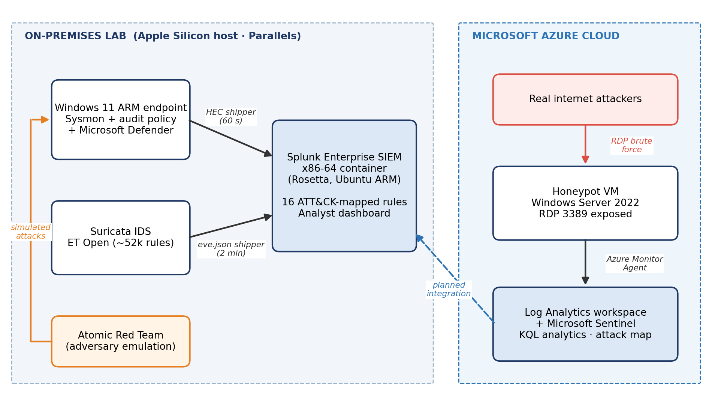

# Hybrid SOC with SIEM-Based Threat Detection

A working **hybrid Security Operations Centre (SOC)** designed for a fictional mid-sized UK financial-services firm:

- **On premises:** a **Splunk Enterprise SIEM** receives Windows endpoint telemetry (Security, Sysmon and Microsoft Defender) and **Suricata** network IDS alerts, with **16 detection rules mapped to MITRE ATT&CK** and an analyst dashboard.
- **In the cloud:** an **Azure honeypot** is monitored by **Microsoft Sentinel**, capturing real internet attacks.
- **Response:** five incident-response playbooks are aligned to **NIST SP 800-61 Revision 3**.
- **Testing:** the detections were validated with **Atomic Red Team**.

Everything was built on **Apple Silicon (ARM64)**, which the standard tooling does not officially support.

> MSc Cybersecurity capstone project, University of Chester (WB7103/WB7104), 2026. The scenario is a financial-services firm, where credential theft, privilege escalation and anti-forensic activity carry direct regulatory and financial consequences.



---

## Key results

| Measure | Result |
|---|---|
| ATT&CK techniques tested with Atomic Red Team | 7, across 5 tactics |
| Detected by SIEM analytics | 6 of 7 (86%) |
| Effective coverage (detected, or prevented by Defender and recorded) | 7 of 7 |
| Mean time to detect | Within one 60-second forwarding cycle |
| False-positive reduction on the noisiest rule | 714 to 29 matches (about 96%) |
| Honeypot: failed logons, 28 Sep – 6 Oct 2026 | **55,313** from **121** unique IP addresses |
| Honeypot: time to first attack | About **10.5 hours** after exposure |
| Honeypot: successful remote logons | None |

Full details are in [evaluation/](evaluation/README.md) and [cloud/](cloud/README.md).

---

## Architecture

| Component | Platform | Role |
|---|---|---|
| Splunk Enterprise (x86-64 Docker) | Ubuntu 24.04 ARM VM + Rosetta | SIEM core: indexing, search, alerting, dashboard |
| Windows 11 (ARM) endpoint | Parallels VM | Monitored workstation |
| Sysmon (ARM64) and advanced audit policy | On the endpoint | Process, registry and credential-access telemetry |
| Microsoft Defender | On the endpoint | Prevention layer; detections forwarded to Splunk |
| Custom PowerShell HEC shipper | On the endpoint | Log forwarding every 60 seconds (replaces the unsupported Universal Forwarder) |
| Suricata (ARM64) + ET Open ruleset | Ubuntu VM | Network IDS; alerts shipped to Splunk every 2 minutes |
| Windows Server 2022 honeypot | Microsoft Azure | Internet-exposed RDP (TCP 3389) only |
| Log Analytics + Microsoft Sentinel | Microsoft Azure | Cloud-native SIEM, KQL analytics, attack map |

### The Apple Silicon engineering challenge

The reference materials assume x86 hardware and VirtualBox. Delivering the project on an M-series MacBook meant re-architecting the stack:

- **Splunk has no ARM build.** It runs as an x86-64 Docker container under Rosetta emulation, with a `systemd` service that re-registers the translation handler at boot so the SIEM survives restarts.
- **The Universal Forwarder is not supported on Windows ARM.** A custom PowerShell script ships events to the Splunk HTTP Event Collector (HEC) instead.
- **A layered ingestion fault was diagnosed and fixed:** timezone offset, event cap and bookmark race, Sysmon filtering, and index routing. See [configs/SETUP.md](configs/SETUP.md).

---

## Detection rules (MITRE ATT&CK)

| # | Rule | ATT&CK | Data source | Severity |
|---|---|---|---|---|
| 1 | Suspicious PowerShell execution | T1059.001 | 4688 | High |
| 2 | Brute-force authentication | T1110 | 4625 | High |
| 3 | New Windows service | T1543.003 | 7045 | Medium |
| 4 | Registry Run-key persistence | T1547.001 | Sysmon 13 | High |
| 5 | Security event log cleared | T1070.001 | 1102 | Critical |
| 6 | Account creation / admin group change | T1136.001, T1098 | 4720, 4732 | High |
| 7 | Explicit-credential logon | T1078 | 4648 | Medium |
| 8 | Security tooling disabled | T1562.001 | 4688 | High |
| 9 | LSASS credential dumping | T1003.001 | Sysmon 10 | Critical |
| 10 | Scheduled task creation | T1053.005 | 4698, 4688 | Medium |
| 11 | Certutil download (LOLBin) | T1105 | 4688 | High |
| 12 | Defender malware detection | Defence in depth | 1116, 1117 | Critical |
| 13 | System and account discovery | T1082, T1087, T1016 | 4688 | Medium |
| 14 | Encoded PowerShell | T1027, T1059.001 | 4688 | High |
| 15 | Suricata network intrusion | Various | Suricata | High |
| 16 | Suricata known CVE / exploit | T1190 | Suricata | Critical |

The full SPL for every rule is in [detection-rules/](detection-rules/README.md), and the coverage map is in [attack-navigator/](attack-navigator/README.md).

---

## Repository structure

```
.
├── detection-rules/    16 SPL detection searches
├── dashboards/         SOC analyst dashboard (Splunk Simple XML)
├── scripts/            Windows HEC shipper and Suricata alert shipper
├── configs/            Environment setup notes and lessons learned
├── playbooks/          Five NIST SP 800-61r3 incident-response playbooks
├── evaluation/         Atomic Red Team results and detection metrics
├── cloud/              Azure honeypot, Sentinel rule and KQL queries
├── attack-navigator/   MITRE ATT&CK Navigator coverage layer
├── evidence/           Screenshots supporting the report
└── docs/               Project timeline
```

---

## Frameworks and standards

- **MITRE ATT&CK:** technique mapping and coverage analysis for every detection
- **NIST SP 800-61r3 / NIST CSF 2.0:** incident-response playbook structure
- **Atomic Red Team:** repeatable adversary emulation for validation
- **Design science research:** build, evaluate and refine the artefact

---

## Status

- [x] SIEM deployed and reboot-resilient on Apple Silicon
- [x] Endpoint instrumented (Sysmon, audit policy, Defender forwarding)
- [x] Automated, time-accurate log ingestion
- [x] 16 ATT&CK-mapped detection rules (14 endpoint, 2 network), tuned and alerting
- [x] Suricata network IDS
- [x] SOC analyst dashboard
- [x] Atomic Red Team validation and MTTD measurement
- [x] ATT&CK Navigator coverage layer
- [x] Azure honeypot with Microsoft Sentinel analytics rule and attack map
- [x] Five NIST SP 800-61r3 incident-response playbooks
- [ ] Atomic tests for the remaining rules (brute force, log clearing, account creation first)
- [ ] Pull honeypot detections into Splunk for a single analyst view
- [ ] Rebuild the SIEM on dedicated x86 hardware (Proxmox)
- [ ] Live demonstration, 11 November 2026

---

## Security and ethics

- All credentials and tokens have been removed from the scripts and replaced with placeholders. Set your own values before use.
- Attack techniques were only run on systems owned by the author, inside an isolated lab.
- The honeypot is passive: it records attempts but never interacts with, traces or retaliates against their sources.
- Attacker IP addresses are reported only in aggregate and are not published here.

---

*This repository is part of an academic project and is shared for portfolio and educational purposes.*
